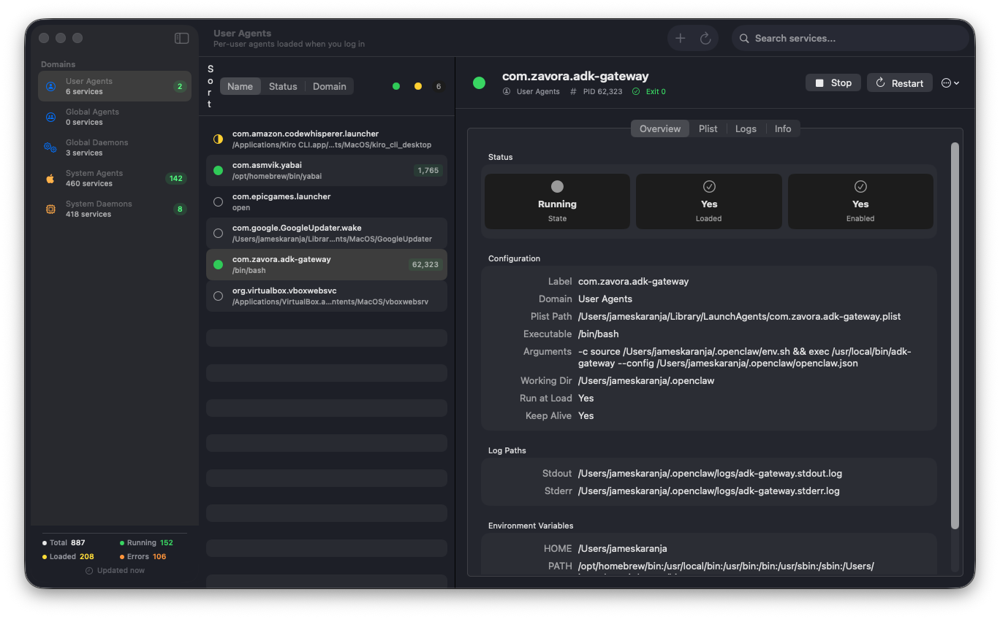

# macOS Launch Manager

A native macOS GUI + CLI for managing launchd services. Replaces the need to wrestle with `launchctl` commands and plist files directly.


## What It Does

macOS uses `launchd` to manage all background services, but there's no built-in GUI for it (unlike Windows Services or Linux systemctl). Launch Manager fills that gap with:



- **GUI App** — Three-column SwiftUI interface for browsing, controlling, and configuring services
- **CLI Tool (`lm`)** — Fast terminal interface for the same operations
- **MCP Server** — Model Context Protocol server so AI assistants (Kiro, Claude Desktop) can manage launchd services

## Installation

### CLI — One-liner (recommended)

```bash
curl -fsSL https://raw.githubusercontent.com/zavora-ai/macos-launch-manager/main/scripts/install.sh | bash
```

### CLI — Homebrew

```bash
brew tap zavora-ai/tap
brew install lm
```

### CLI — Download binary

```bash
# From GitHub Releases (no Swift/Xcode needed)
curl -L https://github.com/zavora-ai/macos-launch-manager/releases/latest/download/lm-v1.0.0-macos-universal.tar.gz | tar xz
sudo mv lm /usr/local/bin/
```

### CLI — Build from source

```bash
git clone https://github.com/zavora-ai/macos-launch-manager.git
cd macos-launch-manager/cli
swift build -c release
cp .build/release/lm /usr/local/bin/lm
```

### GUI App — DMG

```bash
# Build locally
./scripts/create-dmg.sh
# Output: build/LaunchManager-YYYY.MM.DD.dmg
# Open DMG → drag to Applications
```

Or download from [GitHub Releases](https://github.com/zavora-ai/macos-launch-manager/releases).

### MCP Server

```bash
# Build and install
cd mcp-server
swift build -c release
cp .build/release/lm-mcp-server /usr/local/bin/

# Add to Kiro (~/.kiro/settings/mcp.json)
```

```json
{
  "mcpServers": {
    "launchd": {
      "command": "/usr/local/bin/lm-mcp-server",
      "args": [],
      "autoApprove": ["launchd_list", "launchd_status", "launchd_logs", "launchd_info", "launchd_plist_read"]
    }
  }
}
```

For Claude Desktop, add to `~/Library/Application Support/Claude/claude_desktop_config.json`.

## CLI Usage

The `lm` command provides full service management from the terminal:

```bash
# List services
lm                                  # All services (default)
lm list -d user                     # User agents only
lm list -d global-daemons           # Global daemons only
lm list --running                   # Only running services
lm list --loaded                    # Only loaded services
lm list -f docker                   # Filter by name substring

# Service info
lm status <label>                   # Detailed status
lm info <label>                     # Raw launchctl print output
lm logs <label>                     # View stdout/stderr logs
lm logs -f <label>                  # Follow logs (tail -f)
lm logs -l 200 <label>             # Last 200 lines

# Control services
lm start <label>                    # Start (auto-loads if needed)
lm stop <label>                     # Stop (SIGTERM)
lm stop -f <label>                  # Force kill (SIGKILL)
lm restart <label>                  # Stop + start

# Load/unload
lm load <label>                     # Bootstrap into launchd
lm unload <label>                   # Bootout from launchd

# Enable/disable
lm enable <label>                   # Auto-load on boot/login
lm disable <label>                  # Prevent auto-load

# Create/delete
lm create com.company.myservice \
    -p /usr/local/bin/myapp \
    --run-at-load --keep-alive \
    --stdout /tmp/myservice.log \
    --stderr /tmp/myservice.err

lm delete <label>                   # Unload + remove plist
lm delete -y <label>               # Skip confirmation

# Edit
lm edit <label>                     # Open plist in $EDITOR

# GUI
lm gui                              # Open GUI app (installs if not found)
lm gui --reinstall                  # Force reinstall GUI from GitHub
```

### Domains

| Flag | Domain | Path |
|------|--------|------|
| `-d user` | User Agents | `~/Library/LaunchAgents` |
| `-d global-agents` | Global Agents | `/Library/LaunchAgents` |
| `-d global-daemons` | Global Daemons | `/Library/LaunchDaemons` |
| `-d system-agents` | System Agents | `/System/Library/LaunchAgents` |
| `-d system-daemons` | System Daemons | `/System/Library/LaunchDaemons` |
| `-d all` | All (default) | All of the above |

### Status Indicators

```
● running    — Service has an active process
◐ loaded     — Registered with launchd but not running
○ stopped    — Not loaded into launchd
```

## MCP Server

The MCP server exposes launchd management as tools for AI assistants. It implements the Model Context Protocol (JSON-RPC 2.0 over stdio).

### Available Tools

| Tool | Description |
|------|-------------|
| `launchd_list` | List services with domain/status/label filtering |
| `launchd_status` | Detailed service info (PID, exit code, config) |
| `launchd_start` | Start a service (auto-loads if needed) |
| `launchd_stop` | Stop a service (SIGTERM or SIGKILL) |
| `launchd_restart` | Restart a service |
| `launchd_load` | Bootstrap a service into launchd |
| `launchd_unload` | Bootout a service from launchd |
| `launchd_enable` | Enable auto-load on boot/login |
| `launchd_disable` | Disable auto-load |
| `launchd_logs` | Read stdout/stderr log files |
| `launchd_info` | Raw `launchctl print` output |
| `launchd_create` | Create a new service plist |
| `launchd_delete` | Unload and remove a service |
| `launchd_plist_read` | Read raw XML plist content |
| `launchd_plist_write` | Write/update plist content with validation |
| `launchd_force_reload` | Clear stale state and reload (bootout + enable + bootstrap) |
| `launchd_print_disabled` | Query launchd's internal disabled overrides database |
| `launchd_override_status` | Detect conflicts between plist and launchd override state |
| `launchd_open_gui` | Open the Launch Manager GUI app |

### Configuration

**Kiro** (`~/.kiro/settings/mcp.json`):
```json
{
  "mcpServers": {
    "launchd": {
      "command": "/usr/local/bin/lm-mcp-server",
      "args": [],
      "autoApprove": ["launchd_list", "launchd_status", "launchd_logs", "launchd_info", "launchd_plist_read"]
    }
  }
}
```

**Claude Desktop** (`~/Library/Application Support/Claude/claude_desktop_config.json`):
```json
{
  "mcpServers": {
    "launchd": {
      "command": "/usr/local/bin/lm-mcp-server"
    }
  }
}
```

### Example Prompts

Once configured, you can ask your AI assistant:
- "List all running launchd services"
- "What's the status of my adk-gateway service?"
- "Stop com.zavora.adk-gateway"
- "Show me the logs for yabai"
- "Create a new service that runs my backup script every hour"
- "Disable the Google updater from running at login"
- "Force reload the adk-gateway service — it's stuck"
- "Check if any services have conflicting disabled states"
- "Open the Launch Manager GUI"

## GUI Features

- **Three-column layout** — Sidebar domains → service list → detail view
- **All 5 launchd domains** with service counts and running badges
- **Service lifecycle** — Start, stop, restart, load/unload, enable/disable
- **Plist editor** — Edit XML with validation and save
- **Log viewer** — Stdout/stderr + system log with filtering and auto-refresh
- **Create services** — Template wizard (simple agent, periodic task, daemon, web server)
- **Delete services** — Unloads then removes plist with confirmation
- **Search & filter** — By label or executable, filter by status
- **Context menus** — Right-click for quick actions
- **Dark mode** — Full support
- **Universal Binary** — Runs natively on Intel and Apple Silicon

## Project Structure

```
macos-launch-manager/
├── LaunchManager/                  # GUI App (SwiftUI)
│   ├── LaunchManager.xcodeproj
│   └── LaunchManager/
│       ├── LaunchManagerApp.swift
│       ├── ContentView.swift
│       ├── Models/
│       │   ├── LaunchdService.swift
│       │   └── ServiceDomain.swift
│       ├── Services/
│       │   ├── ServiceManager.swift
│       │   └── PrivilegedHelper.swift
│       └── Views/
│           ├── SidebarView.swift
│           ├── ServiceListView.swift
│           ├── ServiceDetailView.swift
│           ├── PlistEditorView.swift
│           ├── CreateServiceView.swift
│           ├── LogViewerView.swift
│           ├── SettingsView.swift
│           ├── SearchBar.swift
│           └── ServiceStatusBadge.swift
├── cli/                            # CLI Tool (Swift Package)
│   ├── Package.swift
│   └── Sources/
│       ├── LM.swift
│       ├── Commands.swift
│       └── Helpers.swift
├── mcp-server/                     # MCP Server (Swift Package)
│   ├── Package.swift
│   └── Sources/
│       ├── main.swift
│       ├── MCPServer.swift
│       └── ServiceManager.swift
├── scripts/
│   ├── create-dmg.sh
│   ├── install.sh
│   ├── generate-dmg-background.py
│   └── dmg-background.png
├── docs/
│   ├── ARCHITECTURE.md
│   ├── USAGE.md
│   ├── DEVELOPMENT.md
│   └── CHANGELOG.md
├── .github/workflows/release.yml
├── README.md
├── LICENSE
└── .gitignore
```

## How It Works

Both the GUI and CLI use `launchctl` subcommands under the hood:

| Action | Command |
|--------|---------|
| List loaded | `launchctl list` |
| Start | `launchctl kickstart -kp <target>` |
| Stop | `launchctl kill SIGTERM <target>` |
| Load | `launchctl bootstrap <domain> <plist>` |
| Unload | `launchctl bootout <target>` |
| Enable | `launchctl enable <target>` |
| Disable | `launchctl disable <target>` |
| Info | `launchctl print <target>` |

Service targets use the format `gui/<uid>/<label>` for user/agent domains and `system/<label>` for daemons.

For system-level operations requiring root, the GUI uses AppleScript `with administrator privileges` and the CLI uses `osascript` to prompt for admin credentials.

## Requirements

- macOS 14.0 (Sonoma) or later
- Xcode 15.0+ (for building from source)
- Swift 5.9+ (for CLI)

## Distribution

### Unsigned (personal use)

```bash
./scripts/create-dmg.sh
# Recipients bypass Gatekeeper with: xattr -cr /Applications/LaunchManager.app
```

### Signed + Notarized (public distribution)

Requires Apple Developer Program ($99/year):

```bash
export DEVELOPER_ID="Zavora Technologies Ltd (TEAMID)"
export APPLE_ID="james.karanja@zavora.ai"
export APPLE_TEAM_ID="YOUR_TEAM_ID"
./scripts/create-dmg.sh
```

## Security Notes

- Runs **without App Sandbox** (required for launchd access)
- System-owned services (`/System/Library/`) are read-only
- Destructive actions require confirmation
- Privileged operations prompt via standard macOS auth dialog
- Universal Binary (arm64 + x86_64)

## Contributing

1. Fork the repository
2. Create a feature branch (`git checkout -b feature/my-feature`)
3. Commit your changes
4. Push and open a Pull Request

## License

Apache License 2.0 — see [LICENSE](LICENSE)

## Author

**James Karanja Maina**
Email: james.karanja@zavora.ai
Company: [Zavora Technologies Ltd](https://zavora.ai)

---

Copyright 2024-2026 Zavora Technologies Ltd
